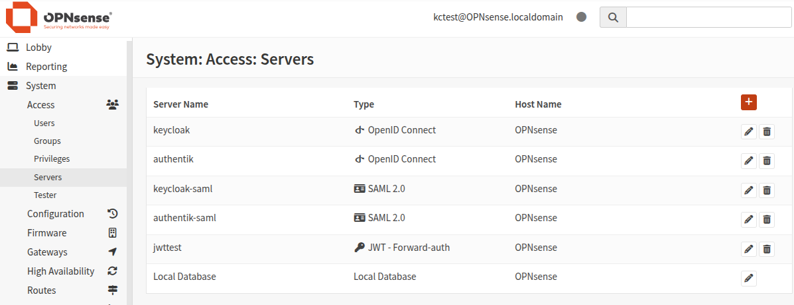
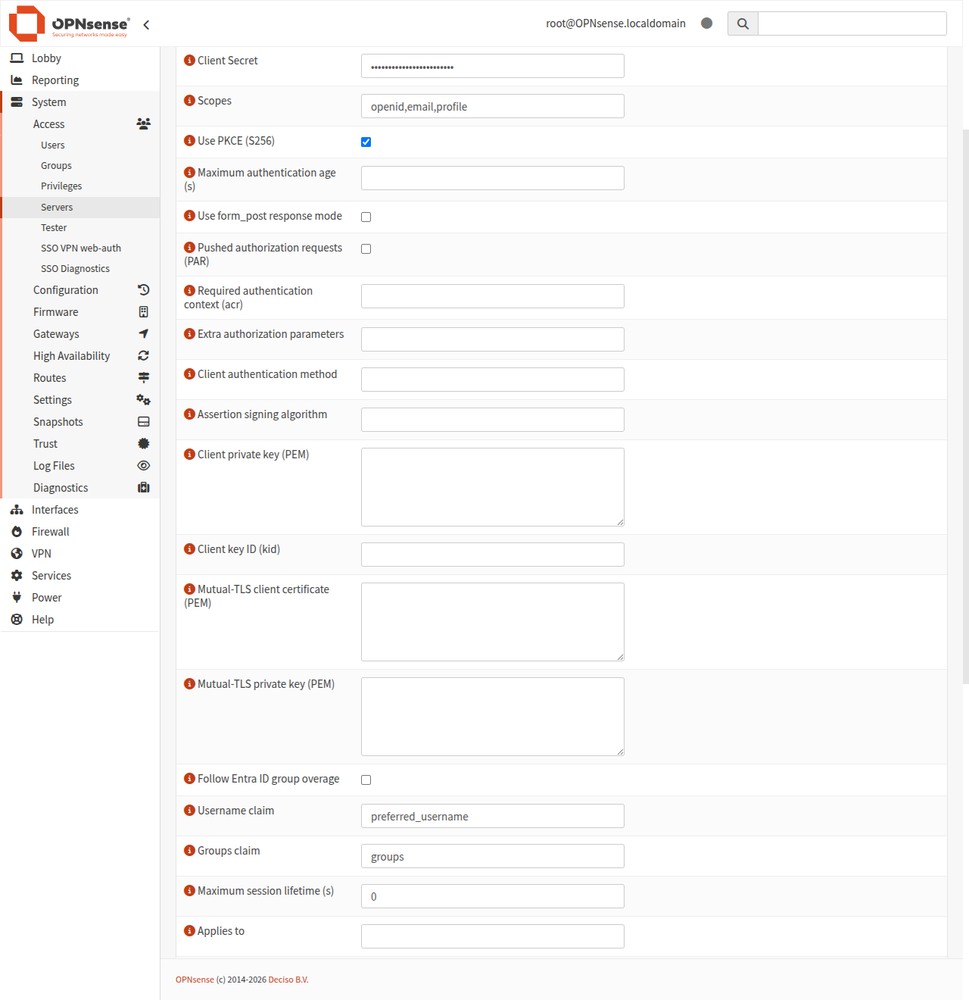
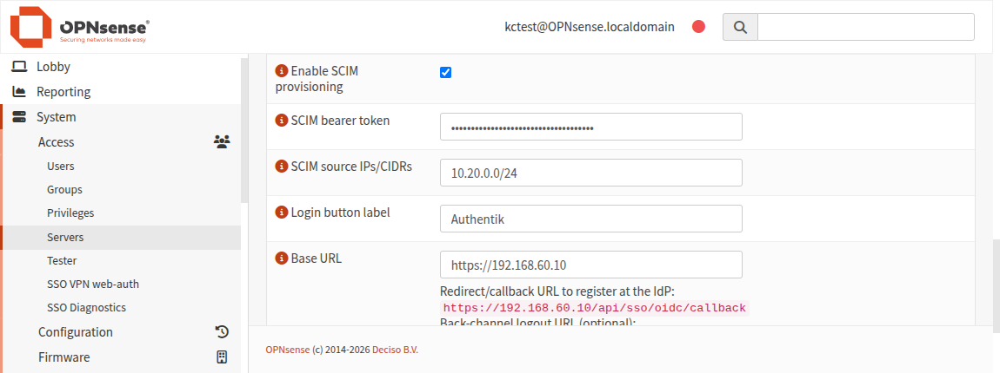
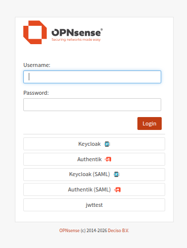
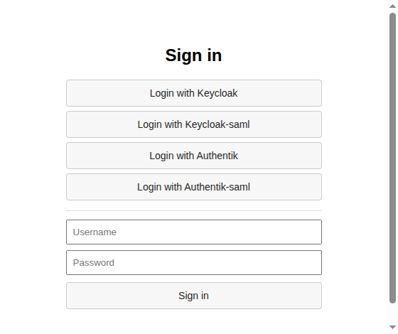
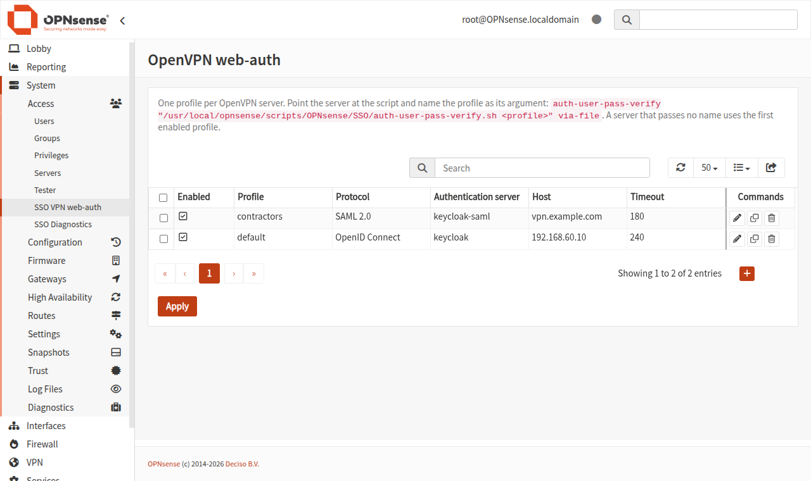
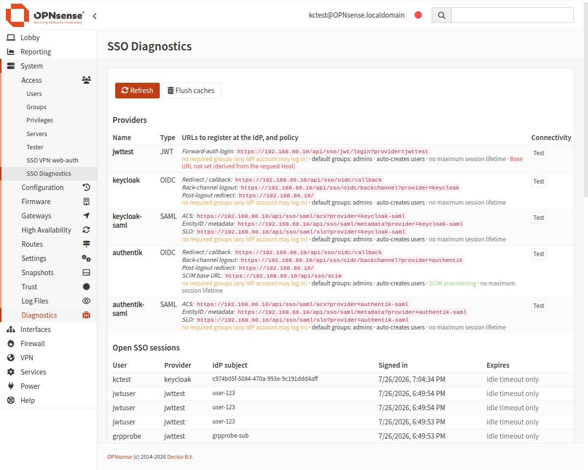

# os-sso - Single Sign-On (SSO) and SCIM provisioning for OPNsense

Add **OpenID Connect**, **SAML 2.0** and **JWT forward-auth** as authentication
types in OPNsense. The firewall acts as a pure consumer (Relying Party / Service
Provider): your users sign in at your existing Identity Provider, and MFA and
passkeys stay there - nothing to re-implement on the firewall.

Works for the **WebGUI**, the **Captive Portal** and **OpenVPN**, with group
mapping driving OPNsense privileges, and takes **SCIM 2.0** provisioning from the
same IdP so account lifecycle does not wait for a login. The local password
(+ native TOTP) always stays available as a break-glass path.

## Features

- **OpenID Connect** - `.well-known` discovery, PKCE, JWKS rotation, and client
  authentication beyond the shared secret: `client_secret_jwt`, `private_key_jwt`
  (serving our own JWKS, so key rollover needs no copy-paste) or mutual TLS. MFA
  context (`acr`) and re-authentication age (`max_age`) are *enforced* on the way
  back, not merely requested. Keycloak, Authentik, Entra ID, Zitadel, …
- **SAML 2.0** - signed and optionally encrypted assertions, metadata import and
  generation, signed AuthnRequests, `ForceAuthn` checked against `AuthnInstant`,
  Single Logout.
- **JWT forward-auth** - trust a signed JWT from a reverse proxy in front of
  OPNsense (oauth2-proxy, Authelia, Authentik forward-auth, Cloudflare Access).
- **WebGUI login** - one button per provider on the login page.
- **Captive Portal login** via OIDC/SAML.
- **OpenVPN** login through the browser (deferred web-auth / `WEB_AUTH`).
- **Group mapping** - IdP groups become OPNsense group membership; privileges are
  resolved by the normal ACL. Reads nested claims (`resource_access.<client>.roles`)
  and follows Entra's group-overage pointer.
- **Single Logout** - the WebGUI *Logout* button ends the IdP session too.
- **SCIM 2.0 provisioning** - the IdP pushes account lifecycle, so a revoked user is
  disabled (and their sessions killed) when the directory says so, not at their next
  login attempt.

## Screenshots

| Authentication servers | Server configuration | SCIM provisioning |
|---|---|---|
|  |  |  |

| WebGUI login | Captive Portal login | OpenVPN web-auth settings |
|---|---|---|
|  |  |  |

| SSO diagnostics |
|---|
|  |

## Requirements

- **OPNsense 25.7 or newer** - the login-page SSO button hook
  (`ISSOContainer` / `listSSOproviders`) landed in core in 25.7.
- For OpenVPN login: **OpenVPN 2.6+** on the firewall and a
  web-auth-capable client (OpenVPN Connect, OpenVPN 3 Linux, Windows 2.6+).
- An Identity Provider you control or use (Keycloak, Authentik, Entra ID, Zitadel, …).

## Install

Each release ships one package per FreeBSD ABI. Download the one matching your
firewall's base from the [Releases](../../releases) page - check it with
`pkg config ABI` (e.g. `FreeBSD:14:amd64` → the `…-FreeBSD-14.pkg`), then install:

```sh
pkg add os-sso-devel-*-FreeBSD-14.pkg   # pick the file matching your ABI
```

Then reload the WebGUI (or reboot). The new server types appear under
**System ▸ Access ▸ Servers**.

> Building from source instead: `make package` on an OPNsense dev VM, or the
> `.github/workflows/build-pkg.yml` job CI runs on a `v*.*.*` tag.

## Configure an authentication server

**System ▸ Access ▸ Servers ▸ ＋ Add**, then pick the **Type**. Every field carries its
own help in the form; below is only what is easy to get wrong, and shared by all types.

| Option | What to watch |
|---|---|
| **Applies to** | Which of *webgui*, *portal*, *vpn* this provider serves. Empty = all three, so a provider added for the portal is also a WebGUI door. |
| **Base URL** (required, OIDC/SAML) | Every URL the IdP is given is built from it; the fallback would trust the request `Host`. Mind a reverse proxy or port-forward. |
| **Username claim/attribute** | Must be immutable and IdP-administered: `preferred_username`, not `email`. |
| **Required groups** | Empty lets in *every* account the IdP authenticates - WebGUI, portal and VPN alike. |
| **Automatic user creation** | Off by default; on, it writes users into `config.xml` with no local password. |
| **Group mapping** | An explicit mapping may target `admins`; the 1:1 name fallback refuses privileged groups. |
| **Strict group sync** | Off = additive. On, revokes only what os-sso granted, never the last privileged member. |
| **Deprovision on refused login** | Disables the account behind a refused login. Does nothing without *Required groups*. |
| **Maximum session lifetime** | The WebGUI timeout is *idle*-only. Needs the **os-sso: expire SSO sessions** cron job. |
| **SCIM provisioning** | Token **and** source addresses, both required - see [SCIM](#scim-provisioning). |

The Base URL matters more than it looks: an IdP doing wildcard redirect matching plus a
forged `Host` header is how an authorization code ends up somewhere else. The form shows
the exact redirect/ACS URL to copy into the IdP.

### OpenID Connect

1. Create a **confidential** client at your IdP with redirect URL
   `https://<opnsense>/api/sso/oidc/callback` (shown live in the form).
2. In OPNsense fill **Issuer URL** + **Client ID/Secret**. Discovery and keys are
   fetched automatically from `<issuer>/.well-known/openid-configuration`.
3. Keep **PKCE** on; scopes `openid email profile`, plus a groups scope if you map
   groups.
4. Optional hardening - **Maximum authentication age** (`max_age`, checked against the
   returned `auth_time`), **Required authentication context** (`acr_values`, checked
   against the returned `acr` - the only way to actually require the IdP's MFA context,
   since honouring the request is voluntary per the spec), **form_post response mode** to
   keep the authorization code out of the URL, and **Extra authorization parameters** for
   things like `prompt=login`.

**Client authentication.** `auto` picks `client_secret_basic` or `client_secret_post` from
the discovery document. The others must be chosen explicitly - they need key material
registered at the IdP first, so auto-selecting one the moment an IdP advertises it would
break every login:

| Method | Needs here | Shared secret |
|---|---|---|
| `client_secret_basic` / `_post` | the client secret | sent on every token request |
| `client_secret_jwt` | the secret, ≥32 chars for HS256 | never leaves the firewall |
| `private_key_jwt` | a client private key (PEM) + algorithm, optional `kid` | none |
| `tls_client_auth` / `self_signed_…` | a client certificate + key (PEM) | none |

For `private_key_jwt`, point the IdP's *JWKS URL* at
`https://<opnsense>/api/sso/oidc/jwks?provider=<name>` (listed on the diagnostics page):
it serves the public key derived from the private one and nothing else, so a rollover needs
no copy-paste. Mutual TLS follows RFC 8705 - an `mtls_endpoint_aliases` token endpoint is
used automatically.

| Provider | Issuer URL | Groups |
|---|---|---|
| **Keycloak** | `https://<kc>/realms/<realm>` | add a *Group Membership* mapper → `groups` |
| **Authentik** | `https://<authentik>/application/o/<slug>/` | add the *Groups* scope |
| **Entra ID** | `https://login.microsoftonline.com/<tenant>/v2.0` | `groups` claim (object IDs - use an explicit name map) |

The **Groups claim** accepts dot notation for a nested claim, which is where roles
usually live: `realm_access.roles` for Keycloak realm roles,
`resource_access.<client-id>.roles` for its client roles. A claim whose own name
contains dots (`urn:oid:…`) is matched whole first, so both styles work.

**Entra ID group overage.** Past ~200 groups Entra drops `groups` and substitutes a
pointer to Microsoft Graph, so a tenant's most heavily grouped users - usually the
administrators - arrive with no groups and are refused by the required-groups gate.
Tick **Follow Entra ID group overage** to resolve it. The firewall asks Graph on its own
behalf (the user's token is scoped elsewhere and cannot be exchanged), so the app
registration needs the **application** permission `GroupMember.Read.All` with **admin
consent**; only Microsoft's own Graph hosts are ever called. Graph returns object ids, the
same values the ordinary claim carries, so the group map is written the same either side
of the threshold. Rather not grant it? Keep the claim under the limit with application
roles or a group filter.

### SAML 2.0

1. In OPNsense either set the **IdP metadata URL** (https) and leave the rest empty -
   the EntityID, SSO/SLO endpoints and signing certificate are read from it and
   cached for 24 h, so an IdP **signing-key rotation is picked up on its own** - or
   fill **IdP EntityID**, **IdP SSO URL** (HTTP-Redirect) and the **IdP x509
   certificate** (full PEM of the signing cert - not a fingerprint) by hand. Anything
   filled in by hand wins over the document.
2. Give your IdP the SP URLs (shown live in the form). Each SAML server is its own
   SP identity, so every endpoint carries `?provider=<server name>` - two IdPs never
   share an EntityID or ACS:
   - ACS: `https://<opnsense>/api/sso/saml/acs?provider=<name>`
   - Metadata / EntityID: `https://<opnsense>/api/sso/saml/metadata?provider=<name>`
   - SLO: `https://<opnsense>/api/sso/saml/slo?provider=<name>`
3. The IdP must **sign the assertion** with RSA-SHA256 (a SHA-1 signature *or digest* is
   refused, unless **Accept SHA-1 signatures** is ticked for an IdP that cannot be moved
   yet) and send **at least one attribute** - an empty
   `<AttributeStatement/>` is invalid per the schema and the strict validation rejects
   it, and you need the groups attribute anyway. Map the NameID to the username; set the
   username/email/display-name attributes explicitly when your IdP emits OID-style names
   (`urn:oid:0.9.2342.19200300.100.1.1`).
4. Optional, all off by default:
   - **Force re-authentication** + **maximum authentication age** - `ForceAuthn` is only
     a request, so the age check on the assertion's `AuthnInstant` is what proves the IdP
     honoured it. The SAML counterpart of OIDC's `max_age`/`auth_time`.
   - **Sign the AuthnRequest** (needs the SP certificate + key) - required by ADFS in a
     strict configuration and by Keycloak with *Client signature required*; it also makes
     the SP metadata declare `AuthnRequestsSigned`.
   - **HTTP-POST binding** for the AuthnRequest, when the IdP will not take a redirect.
   - **Encrypted assertions** (needs the SP certificate + key).
   - **IdP-initiated login** - an unsolicited assertion proves nothing about who asked to
     log in, hence off.

| Provider | IdP EntityID | SSO URL (redirect) |
|---|---|---|
| **Keycloak** | `https://<kc>/realms/<realm>` | `https://<kc>/realms/<realm>/protocol/saml` |
| **Authentik** | `https://<authentik>/application/saml/<slug>/metadata/` (the response Issuer - note the `/metadata/` suffix) | `…/application/saml/<slug>/sso/binding/redirect/` |

### JWT forward-auth

For OPNsense behind a trusted identity-aware proxy that authenticates users and
forwards a **signed JWT in a header**.

1. Fill **Issuer** and **Audience** (both checked), and the **JWKS URL**
   (preferred - supports key rotation) or a static PEM public key.
2. Set **Trusted proxy IPs/CIDRs** - *required*. The JWT header is only accepted
   when the request comes from these source IPs (the proxy), which is what prevents
   anyone else from forging it. The match is on the **direct TCP peer**
   (`REMOTE_ADDR`), never a forwardable header - list the IP that actually connects
   to the firewall. If another reverse proxy fronts the WebGUI, that proxy's IP goes
   here and it must strip the JWT header from untrusted clients.
3. Point the proxy at `https://<opnsense>/api/sso/jwt/login?provider=<name>` and
   have it inject the token in the configured header (default `X-Auth-Request-Jwt`,
   or `Authorization: Bearer`).
4. Bound the replay window. A signed JWT is a bearer credential - whoever holds the
   bytes is the user until it expires. Both controls are off by default because they
   depend on how your proxy issues tokens:
   - **Maximum token age** - refuse tokens whose `iat` is older than N seconds, no
     matter what `exp` says.
   - **Single-use tokens** - accept each token once (keyed on `jti` when present).
     Only if the proxy mints a fresh token per login; if it reuses one token for the
     whole session (the usual oauth2-proxy setup), the second login would be refused.

Only asymmetric algorithms (`RS256`/`ES256`/…) are accepted; `exp`/`nbf` are
enforced.

## Where SSO applies

### WebGUI

Each configured OIDC/SAML/JWT server adds a **“Login with …”** button to the
firewall login page. Users click it, authenticate at the IdP, and land in the
WebGUI with privileges from their mapped groups.

### Captive Portal

1. Add the OIDC/SAML server (as above).
2. **Services ▸ Captive Portal ▸ Administration**: in the zone, add that server
   under *Authentication* (optionally set an enforce-group).
3. Build the bundled portal template and upload it:

   ```sh
   configctl sso build_cp_template     # prints /tmp/os-sso-cp-template.zip
   ```

   Upload that zip under *Templates* and select it on the zone. The page shows one
   button per SSO provider and keeps the standard username/password form. Mind the
   core naming rule: a template *name* may not contain a hyphen (letters, digits,
   `.`, `,`, `_` and spaces only).

   In the lab, `test/vagrant/setup-cp.sh` does the whole thing - zone, template,
   render, unpack, start - and documents the ordering the UI normally handles.
4. Make sure the zone lets unauthenticated clients reach the firewall WebGUI and
   the IdP (zone *allowed addresses* / pre-auth) so the login can complete.

A user who signs in through SSO gets their device authorized in that portal zone.

The "connected" page then bounces them to wherever they were originally headed, which
is an arbitrary external site by design - that is what a captive portal does. The URL
is validated for shape only (no other scheme, no protocol-relative host, no userinfo),
never against an allowlist, so treat `/api/sso/{oidc,saml}/{callback,acs}?cpurl=…` as
an intentional redirector. It carries nothing with it: the page is sent `no-referrer`
so the callback URL - which holds the authorization code and state - never reaches the
destination.

### OpenVPN (deferred web-auth)

OpenVPN 2.6+ “pending auth” lets the client authenticate in a browser:

1. The client connects and is shown a `WEB_AUTH` URL.
2. It opens the URL, logs in at the IdP (passkey/MFA there).
3. The tunnel comes up once the login succeeds.

Configure it under **System ▸ Access ▸ SSO VPN web-auth**: protocol, the
authentication server (picked from the configured OIDC/SAML servers), the host the
client's browser opens, and the web-auth timeout. Saving writes
`/usr/local/etc/sso/vpn.conf` (no more editing it over SSH). Then point the OpenVPN
server at the script:

```
auth-user-pass-verify /usr/local/opnsense/scripts/OPNsense/SSO/auth-user-pass-verify.sh via-file
```

> **Mind the username.** OpenVPN takes it from the client and never revisits it on a
> deferred-auth path: the browser login decides *whether* the tunnel comes up, not
> *whose* it is. Both names are logged on the firewall, so a mismatch is visible.
> Turn on **Require the username to match** if the name is load-bearing on the server
> side (`username-as-common-name`, a `client-config-dir`, per-user rules); leave it off
> for the usual setup where the client sends a throwaway username.

Use a web-auth-capable client (OpenVPN Connect, OpenVPN 3 Linux) - see
`test/vpn-client/README.md`. With web-auth disabled the script denies the connection
rather than deferring it. What the client sees:

```
AUTH_PENDING received, extending handshake timeout from 60s to 240s
Info command was pushed by server ('WEB_AUTH::https://vpn.example.com/api/sso/oidc/login?provider=keycloak&vpn=48e5ef74…')
   ... the user authenticates in the browser ...
Initialization Sequence Completed
```

and on the firewall: `os-sso vpn: authorized tunnel for 'kctest' from 10.0.2.2`.

### Logout

The WebGUI **Logout** button performs Single Logout: it ends the IdP session for
OIDC (`end_session_endpoint`) and SAML, and falls back to the normal local logout
for password sessions. Register at your IdP:

- OIDC post-logout redirect: `https://<opnsense>/`
- SAML logout service: `https://<opnsense>/api/sso/saml/slo?provider=<name>`

**Back-channel logout (OIDC).** Register
`https://<opnsense>/api/sso/oidc/backchannel?provider=<name>` as the client's
back-channel logout URI and the IdP can end the firewall session by itself - when the
user logs out elsewhere, or when you disable the account. Without it (and without a
maximum session lifetime) an open session survives until it idles out. The endpoint
takes only a signed `logout_token`: issuer, audience, `iat` freshness, the
backchannel-logout event, absence of a `nonce` and single-use `jti` are all checked
before any session is ended.

### API access (not SSO)

The OPNsense **API** keeps using its own key/secret credentials - os-sso does not
turn an IdP token into API access, and cannot: API authentication is handled by core
before any plugin sees the request, so bearer-token support would have to land in
core, not here. What does work is the useful half: an account provisioned by SSO is a
normal local account, so you can issue it an API key under *System ▸ Access ▸ Users*
and the ACL applies the groups os-sso mapped. Its local *password* stays unusable -
API keys are separate credentials, not the password.

## SCIM provisioning

Without it, os-sso only learns that someone was revoked when they try to log in --
until then a disabled directory account keeps working here. SCIM inverts that: the
IdP pushes creations, updates and deactivations as they happen, and pre-provisions
accounts so they exist before the first login (which matters as soon as you reference
a user in a rule or a certificate).

Enable it on any authentication server - OIDC, SAML or JWT (**Enable SCIM
provisioning**, a **bearer token**, and the **source IPs** the IdP connects from - all
three required; with no source list every request is refused, rather than every source
being allowed to try the token), then register the base URL at the IdP:

```
https://<opnsense>/api/sso/scim
```

One base URL serves every provider: the bearer token is what says which one a request
belongs to, and an account provisioned under one provider is not silently adopted by
another.

**Supported:** `/ServiceProviderConfig`, `/ResourceTypes`, `/Schemas`, `/Users`
(GET/POST/PUT/PATCH/DELETE, `filter` on `userName` and `externalId`, pagination,
`count=0` as a total-only probe) and `/Groups` (GET plus PATCH of membership). `POST
/Users` answers **201** when it created the account, **200** when it adopted one already
carrying the `userName`, **409** on a repeated `externalId`.

**Not supported:** bulk, sort, ETags, `meta.created`/`meta.lastModified` (config.xml keeps
no per-account timestamps), and filters beyond `eq` - an unsupported filter is refused
rather than silently answered with the wrong set.

This is a write API into a firewall's account database, so four refusals are absolute: a
**privileged** account (system, uid 0, `admins` member) is never touched; an account with a
**real local password** is never taken over; **DELETE deactivates** rather than removes,
because a user can own rules, certificates and API keys; and a **group carrying
administrative privileges** takes no membership from a directory. Groups themselves are
never created or deleted either - the client fills the ones that exist.

## Diagnostics

**System ▸ Access ▸ SSO Diagnostics** shows, for every configured provider, the exact
URLs to register at the IdP (the SCIM base URL included, when SCIM is on), the
effective policy (required groups, auto-creation, group sync, deprovisioning, SCIM,
session lifetime), and a **Test** button that talks to the IdP live -
discovery + JWKS for OIDC, the metadata document for SAML, the JWKS for forward-auth.
It also lists the currently open SSO sessions - each one can be **ended** on the spot,
or all of them at once - and lets you **flush the caches**
(discovery, JWKS, SAML metadata, icons) after changing something at the IdP instead of
waiting out a TTL. Access is gated by its own ACL privilege,
*System: Access: SSO Diagnostics*.

## Security

**Sessions.** Privileges are never stored in the session - the OPNsense ACL resolves them
from group membership on every request. A new session regenerates its ID (anti
session-fixation). A **disabled or expired** account is refused before group sync writes
anything - on the WebGUI, on the VPN, and on the captive portal, which needs no local
account but will not let a revoked one onto the network either.

**Account binding.** An asserted identity binds only to an account os-sso owns or one with
no usable local password - never to one with a real password, and never to a privileged
account (`root`/system, `admins`) it did not create. A scrambled password is *not*
ownership: that is the WebGUI's own "no local login" checkbox, which LDAP-backed
administrators wear. Email matching additionally requires a verified address.

Each account is bound to **one subject per provider**, recorded on first login. A second
subject of the same provider presenting that account's username is refused - the takeover
a mutable username claim would otherwise allow. A second *provider* binds alongside, so
one directory fronted by both OIDC and SAML maps onto a single local account.

**Groups.** A **privileged** group (`admins`, or any carrying full-GUI / shell /
user-manager rights) only ever gains members through an explicit operator mapping; the 1:1
name fallback refuses them. Strict sync revokes only what os-sso granted, never a
hand-assigned group, never the last privileged member.

**Protocols.** OIDC validates `iss`/`aud`/`azp`/`nonce`/`exp`/`iat`, binds `at_hash` to the
access token and requires an asymmetric signature; SAML verifies the assertion signature
and is replay-protected (single-use request id plus a consumed-assertion cache). What the
IdP is *asked* for is also *checked* on return - `max_age` against `auth_time` (SAML:
`AuthnInstant`), the required `acr` against the returned one - because requesting an MFA
context is voluntary per the spec, so only the answer proves anything. The client can
authenticate to the token endpoint with no shared secret at all (`private_key_jwt`, mutual
TLS), and the pre-auth endpoints are rate limited per source (per /64 in IPv6). A login
endpoint only answers a request the browser reports as a top-level navigation, so a
third-party page cannot start one - or, on the forward-auth path where the proxy adds
the token to whatever goes through it, complete one - from an `` tag.

**SCIM** needs a bearer token **and** a source-address allowlist, and refuses on the same
principles as the login path - see [SCIM provisioning](#scim-provisioning).

The local password (+ native TOTP) always stays active as a **break-glass** path: keep at
least one local admin.

> `client_secret`, client keys and SP keys live in `config.xml` like other OPNsense
> credentials (LDAP bind passwords and the like) and are never written to logs.

## Test / lab

Two layers, both under [`test/`](test/) with their own
[README](test/README.md): a dependency-free **unit suite** over the logic that decides
security (every case is a refusal - the part an end-to-end run never reaches), and **eight
end-to-end suites** against a Vagrant OPNsense VM with Authentik and Keycloak in Docker,
driving real browser ceremonies and a real OpenVPN client.

```sh
php test/unit/run.php                                       # ~400 assertions, no setup
cd test && vagrant up && (cd idp && ./up.sh)                # bring the lab up
SSO_GUI_URL=https://192.168.60.10 test/e2e/run-all.sh       # ~150 checks, either IdP
```

## License

BSD-2-Clause. © 2026 Maxime Wewer.
